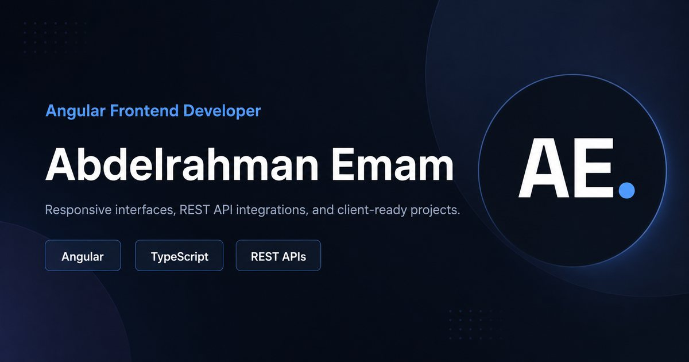

# Abdelrahman Emam Portfolio

<p align="center">
  <a href="https://abdelrahman-emam-portfolio.vercel.app/">
    
  </a>
</p>

<p align="center">
  
</p>

<p align="center">
  <a href="https://angular.dev/"></a>
  <a href="https://www.typescriptlang.org/"></a>
  <a href="https://tailwindcss.com/"></a>
  <a href="https://vercel.com/"></a>
</p>

<p align="center">
  <a href="https://abdelrahman-emam-portfolio.vercel.app/">Live Portfolio</a>
  ·
  <a href="https://www.linkedin.com/in/abd-el-rahman-emam">LinkedIn</a>
  ·
  <a href="https://github.com/Abdelrahman-Tamer">GitHub</a>
  ·
  <a href="mailto:abdelrahmanacc84@gmail.com">Email</a>
</p>

## Overview

This is the production portfolio for Abdelrahman Emam, a Cairo-based Frontend and Angular Developer. The app presents selected client work, Angular projects, services, skills, a dedicated CV route, and an EmailJS-powered contact flow in a polished bilingual interface.

The project is built with Angular 22, strict TypeScript, standalone components, SSR/prerender support, optimized public assets, and route-aware SEO metadata for deployment on static or server-capable hosts.

## Highlights

| Area | What is included |
| --- | --- |
| Portfolio UX | Hero, stats, about, services, projects, skills, process, contact, footer, and floating WhatsApp CTA |
| CV | Dedicated `/cv` route plus downloadable PDF at `/Abdelrahman-Emam-CV.pdf` |
| Internationalization | English and Arabic content with LTR/RTL direction switching |
| Theme | Persistent light/dark mode powered by Angular services |
| Projects | Client work, graduation project, e-commerce, healthcare, bookmark manager, and landing pages |
| Contact | EmailJS form, validation states, mail links, phone links, and WhatsApp handoff |
| SEO | Canonical metadata, Open Graph, Twitter cards, JSON-LD, sitemap, robots, manifest, and social image |
| Performance | WebP project screenshots, lazy routes, optimized Angular production build, and hashed output |

## Tech Stack

- Angular 22 standalone application
- TypeScript 6 with strict compiler settings
- Angular Router with lazy `loadComponent`
- Angular SSR and prerender route configuration
- Tailwind CSS 4 and custom CSS properties
- EmailJS browser SDK
- Vitest through Angular CLI testing
- WebP image assets and static SEO files from `public/`

## Project Structure

```text
src/
  app/
    core/
      config/          # Contact and EmailJS public client config
      data/            # Portfolio content source of truth
      models/          # Strict portfolio data contracts
      seo/             # Route metadata and shared SEO constants
      services/        # Language, theme, and SEO services
    pages/
      cv/              # CV route
      portfolio/       # Main portfolio page and sections
    shared/
      components/      # Reusable icon, card, and skill components
public/
  images/              # Optimized WebP project previews
  *.svg, *.png, *.jpg  # Favicons, manifest assets, and social preview
```

## Getting Started

Use the package manager version declared in `package.json` when possible.

```bash
npm install
npm start
```

The local dev server runs at:

```text
http://localhost:4200/
```

## Available Scripts

| Command | Purpose |
| --- | --- |
| `npm start` | Start the Angular development server |
| `npm run build` | Create the production build |
| `npm test` | Run the Angular test target |
| `npm run watch` | Build continuously in development mode |
| `npm run serve:ssr:my-portfolio` | Serve the built SSR output with Node |

## Production Build

```bash
npm run build
```

Angular writes the deployment artifacts to:

```text
dist/my-portfolio/
```

For static hosting, deploy:

```text
dist/my-portfolio/browser
```

For server-capable hosting, build first and run:

```bash
npm run serve:ssr:my-portfolio
```

## Deployment

Recommended production settings:

| Setting | Value |
| --- | --- |
| Install command | `npm ci` |
| Build command | `npm run build` |
| Static output directory | `dist/my-portfolio/browser` |
| Node SSR entry | `dist/my-portfolio/server/server.mjs` |
| Production domain | `https://abdelrahman-emam-portfolio.vercel.app` |

The repo keeps generated output, local automation logs, Playwright snapshots, dependency folders, and private tool state out of Git through `.gitignore`.

## SEO and Assets

Primary SEO configuration lives in:

```text
src/app/core/seo/seo.config.ts
```

Public deployment assets live in:

```text
public/
```

Important public files:

- `public/og-image.jpg`
- `public/robots.txt`
- `public/sitemap.xml`
- `public/site.webmanifest`
- `public/favicon.svg`
- `public/android-chrome-512x512.png`
- `public/Abdelrahman-Emam-CV.pdf`

## Contact Configuration

The contact form uses EmailJS public browser credentials from:

```text
src/app/core/config/contact.config.ts
```

Only public EmailJS identifiers belong in this file. Do not commit SMTP passwords, Gmail passwords, private service tokens, or any other secret credentials.

## Quality Checklist

- Strict TypeScript configuration
- Lazy route loading for the portfolio and CV views
- SSR/prerender route declarations
- Accessible semantic sections and labelled controls
- Optimized WebP project images
- Route-aware metadata and JSON-LD updates
- Clean Git ignore rules for generated and local-only files

## Author

**Abdelrahman Emam**<br>
Frontend Developer | Angular Developer<br>
Cairo, Egypt

- Portfolio: [abdelrahman-emam-portfolio.vercel.app](https://abdelrahman-emam-portfolio.vercel.app/)
- LinkedIn: [abd-el-rahman-emam](https://www.linkedin.com/in/abd-el-rahman-emam)
- GitHub: [Abdelrahman-Tamer](https://github.com/Abdelrahman-Tamer)
- Email: [abdelrahmanacc84@gmail.com](mailto:abdelrahmanacc84@gmail.com)
